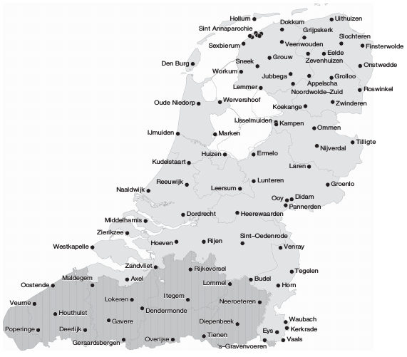
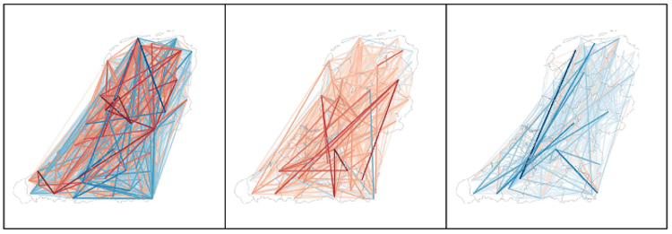
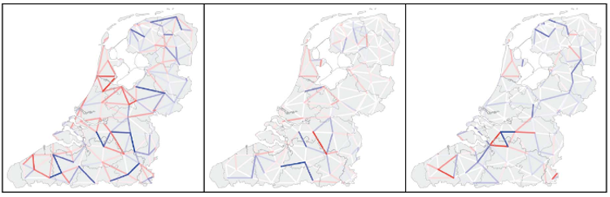

```{r setup, include=FALSE}
options(htmltools.dir.version = FALSE)
knitr::opts_chunk$set(echo = FALSE,
                      message=FALSE,
                      warning= FALSE,
                      fig.width=8.5,
                      fig.height=5)
library(lingtypology)
```


## Goals

* Why do linguists need to create maps?
* What are possibilities of R for creating maps?

## What can you do with linguistic maps?

>1. visualise some languoids (see (@nordhoff11)) under investigation (**language maps**)
>2. visualise the distribution of the linguistic feature(s) in SPACE (**linguistic maps**)
>3. visualise the distribution of the linguistic feature(s) in SPACE + TIME
>4. visualise the relation between some languoid according to some linguistic feature in SPACE (+ TIME)
>5. visualise the interaction between some linguistic feature in SPACE (+ TIME) according to some set of langoids
>6. investigate language stereotypes
>7. simulate spread of the linguistic features in SPACE (+TIME)

## 1. Visualise languoids
* [`lingtypology`](https://github.com/ropensci/lingtypology) can visulise any language from [Glottolog database](http://glottolog.org/)
* dialect information (and coordinates) should be provided by user

## 1. Visualise languoids: Sign languages

```{r}
library(lingtypology)
library(leaflet)
map.feature(lang.aff("Sign"),
            label = lang.aff("Sign"),
            map.orientation = "Atlantic")
```

## 1. Visualise languoids: Circassian dialects

```{r}
library(lingtypology)
map.feature(circassian$language,
            circassian$dialect,
            latitude = circassian$latitude,
            longitude = circassian$longitude,
            label = circassian$dialect,
            tile = "Esri.WorldStreetMap",
            scale.bar.position = "topleft")
```

## 2. Linguistic features + SPACE: <br> Categorical variable

```{r}
map.feature(languages = ejective_and_n_consonants$language,
            features = ejective_and_n_consonants$ejectives,
            label = ejective_and_n_consonants$language,
            title = "ejective sounds",
            )
```

## 2. Linguistic features + SPACE: <br> Numeric variable
```{r}
map.feature(languages = ejective_and_n_consonants$language,
            features = ejective_and_n_consonants$consonants,
            label = ejective_and_n_consonants$language,
            title = "number <br> of consonants")
```

## 2. Linguistic features + SPACE: <br> *moon* in SL
```{r}
# Create a dataframe with links to video
sign_df <- data.frame(languages = c("American Sign Language", "Russian Sign Language", "French Sign Language"),
                      popup = c("https://media.spreadthesign.com/video/mp4/13/48600.mp4", "https://media.spreadthesign.com/video/mp4/12/17639.mp4", "https://media.spreadthesign.com/video/mp4/10/17638.mp4"))

# Change popup to an HTML code
sign_df$popup <- paste("<video width='200' height='150' controls> <source src='",
                       as.character(sign_df$popup),
                       "' type='video/mp4'></video>", sep = "")
# create a map
map.feature(languages = sign_df$languages, 
            popup = sign_df$popup,
            map.orientation = "Atlantic",
            zoom.level = 2)
```


## 2. Linguistic features + SPACE: <br> Tricks for static maps
```{r}
map.feature(languages = ejective_and_n_consonants$language,
            features = ejective_and_n_consonants$ejectives,
            label = ejective_and_n_consonants$language,
            shape = TRUE,
            title = "ejective sounds")
```

## 2. Linguistic features + SPACE: <br> Tricks for static maps
```{r}
map.feature(languages = ejective_and_n_consonants$language,
            features = ejective_and_n_consonants$language,
            label = ejective_and_n_consonants$language,
            shape = 1:19)
```

## 3. Linguistic features + SPACE + TIME: <br> Change in the knowledge of Russian
```{r}
library(tibble)
df <- data_frame(languages = c("Avar", "Avar", "Mehweb"),
           villages = c("Shangoda", "Obokh", "Mehweb"),
           latitude = c(42.246859, 42.28362, 42.2528),
           longitude = c(47.000153, 47.03734, 47.0472),
           `...-1919` = c(43, 25, 22),
           `1919-...` = c(85, 88, 90))
map.feature(df$languages,
            label = df$villages,
            latitude = df$latitude,
            longitude = df$longitude,
            label.hide = FALSE,
            minichart = "bar",
            minichart.data =  df[,c(5:6)],
            minichart.labels = TRUE,
            width = 8,
            tile = "Esri.WorldStreetMap",
            title = "Level of knowledge of Russian",
            scale.bar.position = "topleft")
```
Data collected by [Nina Dobrushina, et. al.](https://multidagestan.com/team)

## 3. Linguistic features + SPACE + TIME: <br> Change in the knowledge of Russian
```{r}
map.feature(df$languages,
            label = df$villages,
            latitude = df$latitude,
            longitude = df$longitude,
            label.hide = FALSE,
            minichart = "pie",
            minichart.data =  df[,c(5:6)],
            minichart.labels = TRUE,
            width = 8,
            tile = "Esri.WorldStreetMap",
            scale.bar.position = "topleft")
```
Data collected by [Nina Dobrushina, et. al.](https://multidagestan.com/team)

## 3. Linguistic features + SPACE + TIME: <br> Change in the knowledge of Russian and Lak
```{r}
library(dplyr)
library(tidyr)
df %>% 
  gather(type, Russian, `...-1919`:`1919-...`) ->
  df

df$Lak <- c(96, 32, 99, 40, 3, 23)  

library(leaflet.minicharts)
library(leaflet)
leaflet() %>%
  addProviderTiles("Esri.WorldStreetMap") %>% 
  addMinicharts(
    df$longitude, df$latitude, 
    chartdata = df[, c("Russian", "Lak")],
    time = df$type,
    width = 45, 
    height = 45,
    showLabels = TRUE)
```
Data collected by [Nina Dobrushina, et. al.](https://multidagestan.com/team)

## 3. Linguistic features + SPACE + TIME: <br> Problems so far?
There is no (as far as I know) a good solution in R for getting data from Raster pictures. As a result it is complicated work with old maps.

>- old roads could explain complex contact situations
>- old maps could show old settlement patterns
>- ...
>- it is also a problem for modern maps

## 4. Relation between some languoids: <br> Logistic regression
```{r}
map.feature(circassian$language,
            features = circassian$language,
            longitude = circassian$longitude,
            latitude = circassian$latitude,
            line.type = "logit",
            tile = "Esri.WorldStreetMap",
            scale.bar.position = "topleft")
```

## 4. Relation between some languoids: <br> Kernal Density contourplot
```{r}
map.feature(circassian$language,
            features = circassian$language,
            longitude = circassian$longitude,
            latitude = circassian$latitude,
            density.estimation = "Circassian",
            density.longitude.width = 0.7,
            density.latitude.width = 0.7, 
            color= c("darkgreen", "blue"))
```

## 4. Relation between some languoids: <br> Kernal Density contourplot
```{r}
map.feature(circassian$language,
            features = circassian$language,
            longitude = circassian$longitude,
            latitude = circassian$latitude,
            density.estimation = "Circassian",
            density.longitude.width = 0.3,
            density.latitude.width = 0.3, 
            color= c("darkgreen", "blue"))
```

## 4. Relation between some languoids: <br> External polygons
```{r}
komi <- read.csv("https://raw.githubusercontent.com/langdoc/kpv-geography/master/kpv.csv")

komi_area <- geojsonio::geojson_read("https://raw.githubusercontent.com/nikopartanen/language_maps/master/geojson/kom.geojson",
  what = "sp")

leaflet() %>% 
  addPolygons(data = komi_area, stroke = 0, opacity = .7, fillColor = "green") %>% 
map.feature(komi$language,
            komi$dialect,
            latitude = komi$latitude,
            longitude = komi$longitude,
            width = 3,
            zoom.level = 6,
            pipe.data = .)
```
Data created by [Niko Partanen](https://github.com/nikopartanen/language_maps).

## 4. Relation between some languoids: <br> @heeringa15
<center></center>

## 4. Relation between some languoids: <br> @heeringa15
<center></center>

Convergence/divergence between dialects measured on the basis of all sound changes (left), on the basis of sound changes which cause dialects to converge to standard Dutch (centre) and on the basis of sound changes which cause dialects to diverge from standard Dutch (right). Red lines indicate convergence and blue lines indicate divergence; the intensity represents the degree of convergence (red shade) or divergence (blue shade).

## 4. Relation between some languoids: <br> @heeringa15
<center></center>

Convergence/divergence between neighbouring dialects measured on the basis of all sound changes (left), on the basis of sound changes which cause dialects to converge to standard Dutch (centre) and on the basis of sound changes which cause dialects to diverge from standard Dutch (right). Red lines indicate convergence and blue lines indicate divergence; the intensity represents the degree of convergence (red shade) or divergence (blue shade).

## 5. Relation between some linguistic features in SPACE (+ TIME): <br> Strokes
```{r}
map.feature(circassian$language,
            features = circassian$dialect,
            stroke.features = circassian$language,
            latitude = circassian$latitude,
            longitude = circassian$longitude)
```

It also possible to converge multiple features to one.

## 5. Relation between some linguistic features in SPACE (+ TIME): <br> What if we have 100 features?

>- Multiple features require a database...
>- that allows working with complex query...
>- Methods for dimension reduction (PCA/MCA, MDS, etc.) allow to cluster features and define the interesting one
>- But anyway it is linguists who need to decide whether feature or feature combination is *interesting* or not.

## 5. Relation between some linguistic features in SPACE (+ TIME): <br> Is space important for feature destribution?

It depends. But how to measure it?

>- Spatial autocorrelation:
>     - Moran's I (@moran48, @odland88). The test statistic, I, ranges in value from negative to positive 1, with 0 indicating random spatial distribution. Positive values indicate a tendency towards clustering of similar values, while negative values indicate a tendency towards dispersion of similar values.
>     - Getis-Ord G~i* (@ord95). This measure tests for local spatial autocorrelation, which asks whether each location is part of a significant high or low-value cluster with its neighbours.

See (@tamminga13, @grieve13) for linguistic usage.

Restriction: good dialectal data. Garbage in --- garbage out.

## 6. Perceptual Dialectology
It looks like it started from works (@preston1982 and @gould86). The field of perceptual dialectology have developed a huge list of instruments:

* Hand-drawn Map Task
* Dialect Difference Rating Task
* Dialect Classification Task
* ...

## 7. simulate spread of the linguistic features in SPACE (+TIME)
It is the only field, where linguistics try to do prediction. It is not homogeneous. Here are some works:

* @abrams03
* @grieve10
* @kretzschmar14

## 8. Conclusions

>- There is a lot of work on linguistic mapping that could be automated
>- To open Science and standards for linguistic mapping will make
>       - our life easier
>       - our research more comparable
>       - our work more reproducible

## Thank you!

G. Moroz (agricolamz@gmail.com)

Link to this presentation: [goo.gl/LUZYev](https://goo.gl/LUZYev)

## Referenses {.smaller}
